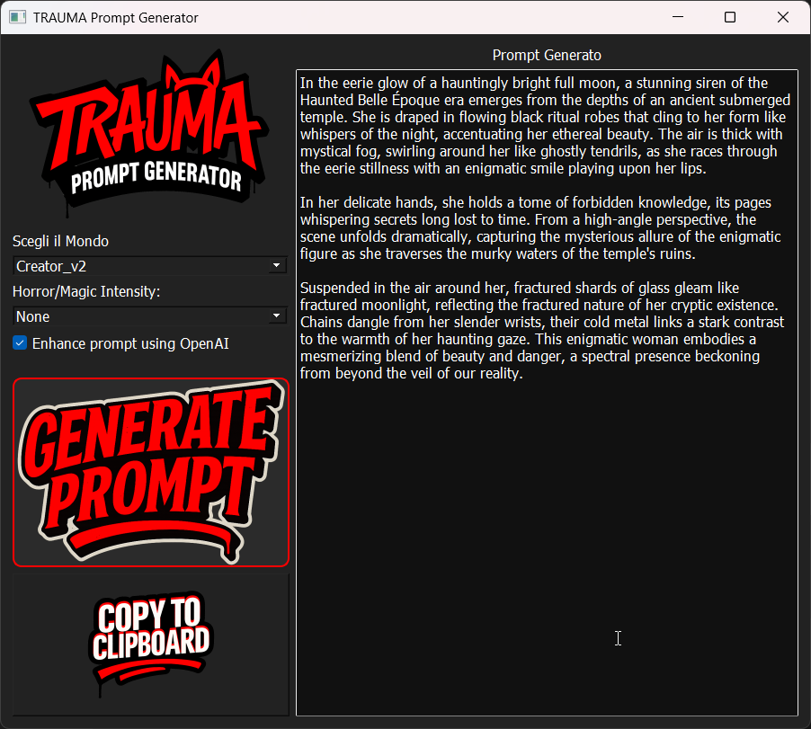

# Prompt Creator V2

🎨 A modular Prompt Generator for image creation with Stable Diffusion, tailored to multiple styles and themes.  
🧠 Powered by OpenAI — API key required.



---

## 🔧 Features

- 🔍 Load and switch between multiple JSON-based prompt libraries from the `JSON_DATA` folder
- ✏️ Built-in **JSON Editor** to manage your prompt sets with ease
- 🌗 Dark mode modern GUI (PyQt5)
- 🧠 Optional integration with OpenAI API (for prompt expansion)
- 🐈 Inspired by Lily, guided by Dante 😽 and the muse Helly 😍❤️❤️❤️😍

---

## 📂 Folder Structure

PromptCreatorV2/
├── prompt_library_app_v2.py # Main Prompt Generator
├── json_editor.py # JSON Editor GUI
├── JSON_DATA/ # Folder containing all .json prompt libraries
│ ├── My_Little_Pony.json
│ ├── Resident_Evil.json
│ └── ...
└── README.md


---

## 🐍 Setup Instructions

> Works on Windows/Linux with Python 3.10+

### 1. Install Python

- [Download Python 3.10](https://www.python.org/downloads/release/python-3100/)
- During install: ✅ check *“Add Python to PATH”*

### 2. Create a virtual environment
python -m venv venv

```bash

Activate the environment

On Windows
---
venv\Scripts\activate
```bash

On Linux/MacOS
---
source venv/bin/activate
```bash

Install requirements

---

pip install -r requirements.txt

```bash

🚀 Launch the App

---

python prompt_library_app_v2.py

```bash

To edit prompt files:

---

python json_editor.py

```bash

🔑 OpenAI Integration
To use OpenAI prompt expansion, add your key:

---

openai.api_key = "your-api-key"

```bash

API KEY  retrived here https://platform.openai.com/account/api-keys  (requires paid account)

💖 Credits
Thanks to:

Magnificent Lily ❤️

My Wonderful cat Dante 😽

My one and only muse Helly 😍❤️❤️❤️😍

